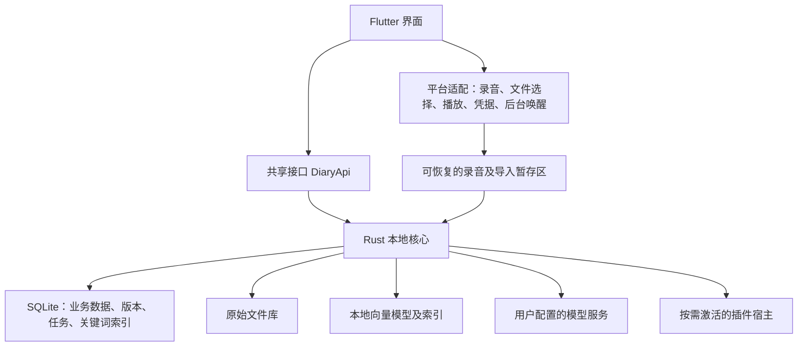

# 不写日记：开发总览

版本：计划 v1.0 · 日期：2026-09-26 · 状态：供开发模型执行的方案，尚未实现或实测。

## 1. 如何使用这套文档

这套计划把工作按代码层拆成任务，不预设由谁执行：F 与 B 只表示任务属于哪一层，任何任务谁都可以认领。本次任务中不创建应用代码。

| 文件 | 用途 | 阅读人 |
|---|---|---|
| [01-共享接口契约.md](01-共享接口契约.md) | 数据对象、方法、事件、状态及共同规则 | 双方必读 |
| [02-前端开发任务书.md](02-前端开发任务书.md) | Flutter 界面、系统能力、交互和前端层任务 | 做前端层任务的人 |
| [03-后端开发任务书.md](03-后端开发任务书.md) | 本地核心、存储、检索、模型、队列和插件 | 做后端层任务的人 |
| [04-验收与测试计划.md](04-验收与测试计划.md) | 功能、异常、性能和交付门槛 | 双方必读 |
| [05-模型交接提示词.md](05-模型交接提示词.md) | 按任务复制给 AI 模型的开工说明 | 认领任务的人 |

文档优先级：用户后续明确要求 > 本文件中已确认的产品要求 > 共享接口契约 > 任务书。建议选型和验收目标可以根据验证结果调整，但必须记录原因，不能把产品需求悄悄降级。

任务怎么认领、怎么避免两个人改同一个文件，见 [CONTRIBUTING.md](../../CONTRIBUTING.md) 第 1 节。

## 2. 已确认的产品要求

1. 首版支持 Windows 和 Android，先完成单设备体验，不做跨设备自动同步。
2. 打开快、输入快、录音快、保存可靠；记录不能等待网络、AI、索引重建或插件初始化。
3. 支持文字、语音、附件；保留原始材料，并将日记与原件关联，回看时可打开或播放。
4. 短碎片和长时间倾诉共用自然的记录流程，不限制用户表达长度，不强迫先选择记录模式。
5. 默认安静记录，只有用户主动请求才让 AI 回应。
6. AI 自动整理日记：简洁精粹、有感染力、忠于事实，按用户风格提供适度情绪价值；正文用自然段，不写分点总结。
7. 允许提炼、重组和润色，不能虚构事实、内心活动或因果。不同时间的想法可以并存，不强行写成积极结局。
8. 修改后默认保留版本；采用哪一版、如何处理重新生成结果，由用户选择。
9. 搜索统一覆盖日记和原始材料；加入本地向量检索，结合关键词与条件筛选。
10. 默认内置小型向量模型；日记生成等复杂能力通过用户配置的远端服务处理。
11. 自动整理失败不影响原件保存，任务排队，状态清楚，减少通知打扰。
12. 轻量、开源、可移植，提供社区插件接口。后续考虑 Linux、macOS、iOS、鸿蒙，首版不宣称这些平台已受支持。

以下属于本计划的建议而非用户已经指定的细节：Flutter + Rust 技术栈、具体模型候选、性能预算、默认整理时间、文件格式覆盖顺序、插件运行时和最低系统版本。

## 3. 首版产品范围

### 必须完成的闭环

打开应用 → 输入文字/录音/选取附件 → 本机可靠保存 → 后台转写或解析 → 形成关键词及向量索引 → 到整理时机生成自然段日记 → 点开查看来源 → 搜索找回原件 → 编辑并保留版本 → 备份与恢复。

首版的“单设备”指两端分别拥有独立资料库。安装了两端不会自动互通。通过备份迁移数据不等于同步，界面必须表述准确。

### 支持范围分层

| 功能 | 首版要求 | 后续扩展 |
|---|---|---|
| 文字 | 输入、粘贴、草稿、追加、原始文字修订历史 | 手写和画布 |
| 音频 | 点按录音、暂停、继续、长录音、锁屏录音、播放、转写后定位 | 实时语音对话、声音事件识别 |
| 图片 | 选图、拍照、粘贴截图、原图查看；配置相应能力后 OCR/画面描述 | 专用图片向量模型、以图搜图 |
| 视频 | 导入、播放、声音转写；画面理解作为后续处理能力 | 密集关键帧分析和精确视觉片段搜索 |
| 文件 | 任意文件可保存；首版内置 TXT/Markdown/文本 PDF/DOCX 的正文提取 | 更多格式由插件增加 |
| 扫描文档 | 没有 OCR 时显示“仅文件信息可搜”；有配置后处理 | 专用离线 OCR 包 |
| 搜索 | 原文、日记、转写、已提取内容的混合搜索，定位来源 | 多轮检索问答和复杂关系分析 |
| 日记 | 按天整理、手动生成、重生成、风格设置、来源和版本 | 周报、月报及高级主题集 |
| 回应 | 用户主动发起一次文本回应；回应单独保存 | 实时语音陪伴 |
| 插件 | 声明式模板/服务适配与受限代码插件；安装、启停、权限、示例 | 在线插件市场和插件自定义完整页面 |
| 数据 | 本地资料库、导出、完整备份、恢复、回收站 | 自动同步、多设备冲突解决、端到端同步加密 |

“什么都能搜”是统一入口与持续扩展的目标，不等于未经解析就能搜索任意二进制内容。未解析、解析失败、不支持的范围必须可见，不能把处理失败显示成“没有相关内容”。

## 4. 建议架构

建议采用 Flutter 前端 + Rust 本地核心。这里的后端位于用户设备，不是必须部署的云服务器。不引入账号系统、常驻本地 HTTP 服务、Redis、消息中间件或独立向量数据库服务。

### 选型建议与验证点

| 部分 | 建议 | 冻结选型前需要验证 |
|---|---|---|
| UI | Flutter/Dart | Windows 输入法、拖放；Android 冷启动、键盘、长列表 |
| 本地业务核心 | Rust | Android arm64 和 Windows x64 编译、数据库、后台任务 |
| 调用桥 | flutter_rust_bridge | 异步调用、事件流、取消、后台运行入口、生成文件所有权 |
| 业务存储 | SQLite + FTS5 | 中文短词检索、事务、升级恢复、后台并发 |
| 原始文件 | 应用管理的独立文件库 | 大文件流式导入、校验、崩溃恢复和空间不足 |
| 本地向量推理 | ONNX Runtime CPU 路径优先 | 两个平台的模型算子、推理耗时、内存、包体 |
| 向量模型 | bge-small-zh-v1.5 INT8 为首个候选 | 中文口语、短查询、量化质量；它不是最终选型结论 |
| 向量索引 | 嵌入式索引，通过 VectorIndex 接口隔离 | 先实现简单正确基线，以 10 万片段评估是否需要 ANN；只交付一个默认方案 |
| 插件执行 | 声明式配置优先；代码插件候选 Wasm/wasmi | 两端可用、执行预算、包体和宿主权限；M0 验证失败必须提出可执行替代方案 |

Flutter 官方支持 Windows、Android 等平台，鸿蒙需要单独评估适配，不能由这次选型直接保证。[Flutter 平台说明](https://docs.flutter.dev/reference/supported-platforms)

Flutter/Rust 桥接方案覆盖 Windows 与 Android，但项目仍需验证具体桥接与打包流程。[桥接平台说明](https://cjycode.com/flutter_rust_bridge/guides/cross-platform/overview)

候选量化模型的单个权重文件约 23.9 MB；应用总大小还包含运行库、分词器和其他资源，运行内存需单独测量。[模型文件](https://huggingface.co/Xenova/bge-small-zh-v1.5/tree/main/onnx)、[移动部署说明](https://onnxruntime.ai/docs/tutorials/mobile/)

## 5. 代码分层与目录职责

以下是未来开发时建议创建的目录。本次只创建计划文档。

前后端是**代码层**，不是**人**：同一个开发者可以同时承担两层。下表规定的是层间边界，不是人的归属。

| 路径 | 所属层 | 职责 |
|---|---|---|
| apps/diary_app/ | 前端层 | 界面、导航、交互、页面状态、应用壳 |
| packages/platform_host/ | 前端层 | Windows/Android 系统接口、录音、播放、文件选择、系统凭据、后台唤醒 |
| packages/diary_api/ | 跨层 | 与 Rust 无关的 Dart DTO 和抽象接口，只按共享契约修改 |
| packages/diary_mock/ | 前端层 | 实现 DiaryApi 的确定性模拟数据和故障场景 |
| packages/diary_bridge/ | 后端层 | Rust 桥的 Dart 适配及生成文件，不放页面逻辑 |
| crates/diary_core/ | 后端层 | 数据、业务规则、搜索、队列、模型和插件 |
| crates/diary_bridge/ | 后端层 | 对 Flutter 的薄接口和生成入口 |
| models/manifest/ | 后端层 | 模型版本、哈希、许可证及预处理描述 |
| plugins/examples/ | 后端层 | 模板插件、导出插件、宿主示例 |
| tests/fixtures/ | 跨层 | 两端共用的虚构资料与接口场景 |
| tests/e2e/ | 前端层 | 跨层用户流程和平台验收 |
| docs/architecture/ | 跨层 | 架构决定和接口变更记录，起草人负责，另一人确认 |

应用根目录及平台工程配置属于前端层，后端层提供依赖、编译和链接改动清单，由认领该任务的人合入应用工程。Rust 工作区、接口包和桥接生成输出属于后端层。同一个锁文件或生成输出同时只能出现在一个 PR 里；生成脚本由后端层的代码维护，不允许手改生成代码。

录音是必须明确的边界：前端平台层负责实际收音、录音前台服务和可恢复暂存；后端层负责录音会话登记、片段接收、转写和索引。界面被销毁不应导致平台录音依赖的对象同时消失。

## 6. 并行开发顺序

| 阶段 | 前端层交付 | 后端层交付 | 阶段通过条件 |
|---|---|---|---|
| M0 可行性与契约 | 两端最小壳、原生长录音验证、系统能力报告 | DiaryApi 类型包、桥接小闭环、本地模型/索引/插件运行验证 | 两端能调用同一核心；契约 v1 冻结；风险和性能基线明确 |
| M1 记录与持久化 | 快速输入、录音控制、附件导入状态、重启恢复 UI | 草稿/原件/文件库、录音登记、事务和恢复 | 断网可记录；已确认保存的数据重启后存在 |
| M2 搜索和回看 | 搜索、过滤、结果聚合、原件定位与播放器 | 文本提取、全文检索、本地向量、片段定位 | 混合搜索可离线；覆盖状态真实；中文短词可用 |
| M3 AI 整理与版本 | 模型设置、正文阅读、风格、版本、主动回应 | 供应商适配、转写/视觉任务、生成、版本和来源关联 | 可用真实服务完成一日闭环；不覆盖人工编辑 |
| M4 自动化与插件 | 整理时机设置、任务中心、插件管理和权限界面 | 持久队列、重试、日归属、插件 SDK 和示例 | 失败不丢资料；两端安装同一跨平台示例插件 |
| M5 备份与交付 | 备份恢复向导、回收站、性能体验、打包 | 一致性备份、恢复验证、升级兼容、索引重建 | 全部发布门槛通过，两端可安装包及测量报告齐全 |

M0 最先发布可编译的共享 DTO 和 DiaryApi 类型包（B0），不等核心全部实现完成。拿到类型包后即可用 Mock 独立开发页面（F0）。M1 开始真实接口联调，不允许把全部联调推迟到 M5。每阶段都有前后端可演示的真实闭环。

谁做哪一层由认领决定：同一阶段里一个人可以同时做 F 和 B 的任务，两个人也可以都做同一层，只要不同时改同一个文件。当前阶段的任务在看板上以 issue 形式存在，认领规则见 [CONTRIBUTING.md](../../CONTRIBUTING.md)。

主仓库许可证已确定为 MIT（见仓库根目录 `LICENSE`）。M0 仍需记录依赖许可证及模型再分发条件。不能把主仓库开源等同于所有模型和依赖拥有相同授权。

## 7. 自动整理的产品语义

建议默认在本地日记时区 22:30 尝试整理当日已提交材料，时间可设置。这个时间是计划触发时间，不是完成承诺。没有材料时不编造日记；尚在录音或尚未提交的草稿不强行纳入。

Android 通过允许的后台调度尝试处理，可能被省电策略推迟。Windows 在应用运行期间调度，完全退出后首版不保证夜间运行；下次启动恢复到期任务，但不阻塞记录界面。可选托盘常驻与系统自启动属于后续能力，不默认开启。[Android 后台调度说明](https://developer.android.com/reference/androidx/work/PeriodicWorkRequest)

有材料未解析时允许基于已有内容生成，并显示覆盖情况；不得声称已整理全部材料。当天后续材料到达时，建议最多再自动补充一次生成，结果保存为候选版本。用户正在编辑或当前版本含人工修改时，绝不自动替换。首次生成且没有当前版本时可自动设为当前。

任务不是“恰好执行一次”的理想化假设：要使用输入快照和幂等键防止本地重复版本；远端超时可能已经产生费用，不能声称重试绝不会重复计费。

## 8. 发布前必须留下的证据

需交付 Windows 安装包/便携包、Android 安装包、构建说明、依赖锁定、许可证清单、模型来源和校验值、插件 SDK、接口版本记录、备份恢复说明，以及功能和性能测量报告。

暂定只发布 Windows x64 和 Android arm64。最低系统版本在 M0 根据依赖与测试设备冻结，不在未验证时声称兼容所有 Windows 或 Android 设备。

性能数值见验收计划，都是待验证的目标，不是现有成果。没有实机、没有真实服务或没有相应构建环境的部分必须标注未验证，不允许以模拟器截图或 Mock 通过替代真实验收。
